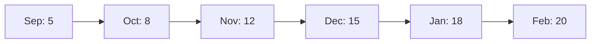

# 統計・可視化スキル

## 役割
学びのパターンを統計・グラフ化して成長を可視化する。

## 1. カテゴリ別学び数（棒グラフ）

ASCII artで棒グラフを生成：

```
📊 カテゴリ別学び数

Code Quality    ████████████████ 16
Security        ████████████ 12
Performance     ██████████ 10
Git             ████████ 8
Review          ██████ 6
Testing         ████ 4
Architecture    ██ 2
```

**生成スクリプト:**
```bash
grep -h "category:" ~/.kiro/learnings/*.md | \
  sed 's/category: \[//; s/\]//; s/, /\n/g' | \
  sort | uniq -c | sort -rn | \
  awk '{
    count=$1; 
    category=$2; 
    bar=""; 
    for(i=0; i<count; i++) bar=bar"█";
    printf "%-15s %s %d\n", category, bar, count
  }'
```

## 2. 月別学び記録数推移

```
📈 月別学び記録数推移（直近6ヶ月）

20 │                              ●
   │                         ●    │
15 │                    ●    │    │
   │               ●    │    │    │
10 │          ●    │    │    │    │
   │     ●    │    │    │    │    │
 5 │     │    │    │    │    │    │
   │     │    │    │    │    │    │
 0 └─────┴────┴────┴────┴────┴────┴─
   Sep  Oct  Nov  Dec  Jan  Feb  Mar
```

または、mermaid形式で：



## 3. 最も成長したカテゴリ

前月比または前年比で成長率を計算：

```markdown
🚀 最も成長したカテゴリ

1. **Testing** (+300%)
   - 先月: 2件 → 今月: 8件
   - テストへの意識が大幅に向上！

2. **Architecture** (+150%)
   - 先月: 4件 → 今月: 10件
   - 設計力が着実に成長中

3. **Security** (+50%)
   - 先月: 8件 → 今月: 12件
   - セキュリティ意識が定着
```

## 4. タグクラウド

頻出タグを視覚的に表示：

```
🏷️ タグクラウド

    review          refactoring
  git    typescript    testing
    docker    performance
  security    database    api
    react    optimization
```

## 5. 統計サマリー

```markdown
📊 全体統計

**総学び数:** 127件
**記録開始日:** 2025-09-01
**記録日数:** 89日
**平均記録頻度:** 1.4件/日
**最長連続記録:** 12日
**最も活発な月:** 2026年2月（20件）
**最も多いカテゴリ:** Code Quality（35件）
**最も多いタグ:** review（42件）
```

## 使用例

- 「学びの統計を見せて」
- 「成長グラフを表示」
- 「どのカテゴリが一番多い？」
